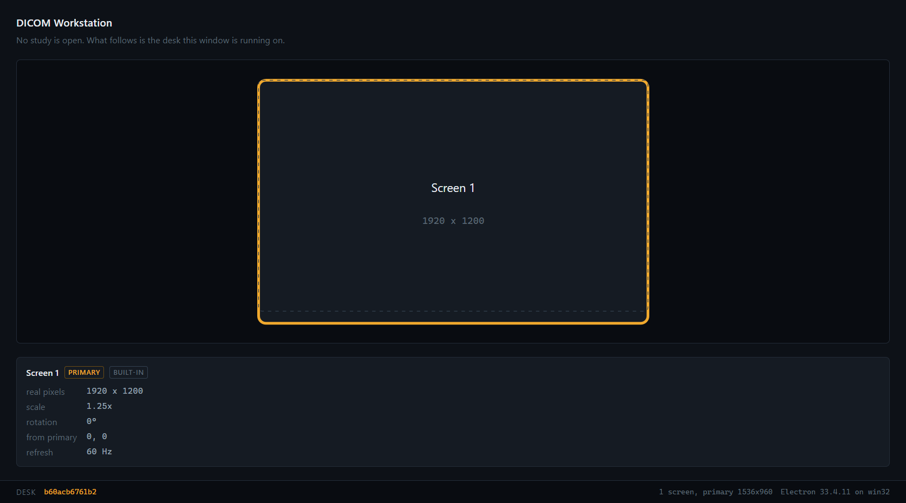

# DICOM Workstation

A desktop reading workstation for CT and MR studies: native windows placed on
the panes of glass they belong to, arrangements that come back the next
morning, and studies read straight off the disk.

The original was built for a client and lives in a private repository. This is
an independent reimplementation, written from scratch with synthetic data.

## Where it is

Early, and honest about it. A folder of studies opens and reads into a
worklist. Nothing displays an image yet.

```
npm install
npm run demo-data          # writes ~17 MB of synthetic studies into ./demo-data
npm start                  # builds and opens the window
npm start -- --open ./demo-data
npm run index -- ./demo-data   # the same reading, in the terminal, no window
npm run displays           # what screens are attached, and this desk's fingerprint
npm test
npm run mutations          # breaks the code on purpose, checks the tests notice
```


Drop a folder anywhere in the window, choose one, or name it on the command
line. A second launch hands its arguments to the first rather than starting a
rival copy, which is how a study opened from the file manager will arrive.

## Where the reading happens

Not in the window, and not in the page.

A thousand headers is a thousand file opens and a thousand parses. In the main
process that blocks the event loop and the window stops repainting — the
application looks hung at exactly the moment it is working hardest. In the
renderer it would mean handing a page the file system, which is the one thing
a viewer that renders whatever a study contains should not have.

So it happens in a utility process: Node, with the disk, and no window. It
reports progress once per percent rather than once per file, because on a fast
disk the messages cost more than the reading. Picking a second folder while the
first is still going aborts it — finishing would send back a list for a folder
nobody is looking at any more. If the process dies mid-folder the window is told
which folder was lost, instead of watching a progress bar that will never move
again.



With no folder open the window shows the desk it is standing on, drawn to
scale. That is not a placeholder: everything this application will do is place
windows on those panes and put them back where they were, and being able to see
the arrangement it believes in is what makes that debuggable rather than magic.
It redraws when a monitor is plugged, unplugged or rescaled — and only when the
fingerprint actually moves, since the same event also fires for a colour profile
change, which moves no window.
## Reading a folder

`npm run index -- ./demo-data` walks a folder, reads every DICOM header it
finds, and prints the reading list:

```
Bianchi Anna   DEMO-0001
  2024-04-12  CT CHEST WITH CONTRAST   CT   80 images   acc A2024-0412-31
      1. SCOUT                           2 img  256x256    0.3 MB  ordered by number
      2. AXIAL 1.0MM                    64 img  256x256    8.1 MB  ordered by position
      3. AXIAL 5.0MM                    14 img  256x256    1.8 MB  ordered by position
  2022-01-18  CT CHEST   CT   14 images   acc A2022-0118-07
      2. AXIAL 5.0MM                    14 img  256x256    1.8 MB  ordered by position

134 images read, 1 files skipped as not DICOM in 64 ms
```

Three decisions in there are worth stating.

**The pixels are never read.** A chest CT is a few hundred files of half a
megabyte each, and indexing them means opening every one. The reader takes a
chunk off the front and parses until the pixel data element, so a study of any
size costs a few hundred bytes per image instead of half a megabyte. The chunk
size is a guess, and a guess about DICOM headers is always wrong somewhere, so
the guess is allowed to be wrong: run off the end and it reads more.

**Slices are ordered by geometry, not by number.** InstanceNumber is a label.
Scanners number series backwards relative to the direction of travel, some do
not number them at all, and a series merged from two acquisitions can repeat
numbers outright. What is reliable is that each slice carries its own corner in
patient coordinates and the series carries the plane it was cut on: project one
onto the normal of the other and you have a real distance along the stack. The
listing says which key each series was sorted by, because a stack ordered by
number is a stack that might be upside down.

**A folder from a CD is a mess, and that is not an error.** Autorun files,
readmes, thumbnails and the viewer that came on the disc are counted and passed
over. A file that claims to be DICOM and will not parse is a different thing
entirely — that is a missing slice — so it is reported by name.

## Why a fingerprint, and not the screen id

The operating system hands out an id for every display, and it is the obvious
key for remembering where a radiologist put their windows. It is also the wrong
one: those ids do not survive a reboot, a cable moved to another port, or a
monitor waking in a different order. A layout saved against them comes back
attached to the wrong glass, or to none.

What does survive is the shape of the desk — how many panes, how big in real
pixels, at what scaling and rotation, and where each sits relative to the
primary. The fingerprint is a digest of exactly that, with ids, labels and
enumeration order deliberately thrown away first.

## The mutation check

`npm test` says the tests ran. It does not say they would catch anything.
`npm run mutations` removes one thing the code is meant to guarantee, runs the
suite, and reports any mutation the tests slept through.

It earned its place the first time it ran: four of six mutations survived. The
desk fingerprint could quietly lose pane size, scaling, and built-in-versus-
external without a single red line, and the test on screen labels was being
defeated by its own fixture, whose fake ids happened to be 1, 2 and 3 — the
very ordinals it was written to tell them apart from.

It has since caught two more of the same kind. A test that a text file is
skipped rather than reported as corrupt was passing on a 34-byte fixture, which
never got past the length check to reach the check being tested. And a test that
an unnumbered slice sorts last was passing against a deliberately broken
comparison, because with three elements the sort happens to come out right
anyway.

## No patient data

There is none in this repository and there never will be. `npm run demo-data`
writes the studies the demo runs on: two patients, a prior study to compare
against, series of different slice thickness, a scout view, and a readme file
that is not DICOM, because a real folder always has one. Every image is drawn
from a formula — a sphere inside a cylinder, in Hounsfield units, with ribs and
one inclusion to find.

## Limits, honestly

- No image is displayed yet. A folder reads into a worklist; opening a series
  is the next thing.
- The window opens on the primary screen at a workable size. Placing it on the
  reporting monitor, and putting it back where it was, is what the fingerprint
  is for and is not built yet.
- Verified on Windows 11 against a single built-in screen. Every multi-monitor
  case here — a screen to the left of the primary and so at negative
  coordinates, a portrait pair, a taskbar taking space off one edge — is
  covered by tests against invented desks, because inventing one is the only
  way to test it without owning it. None of it has met real hardware.
- Explicit and implicit VR little endian are read, and both are covered by
  tests. Big endian is not handled. Compressed transfer syntaxes read their
  headers fine, which is all the index needs, but nothing decodes pixel data
  yet because nothing displays it yet.
- Files without the 128-byte preamble and `DICM` marker are treated as not
  DICOM. Raw datasets written without a Part 10 wrapper will be skipped.
- `physical` is `bounds x scaleFactor` — the panel's real pixel count as the
  system reports it, which is not the same as its advertised specification.
- If `ELECTRON_RUN_AS_NODE` is set in your shell, Electron starts as plain Node
  and no Electron API exists. `npm run displays` says so and stops.
