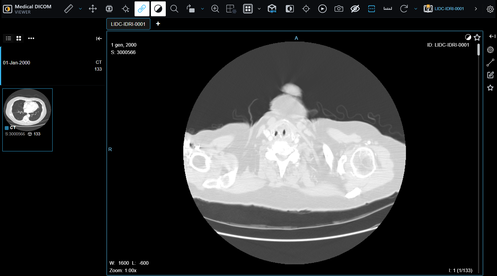
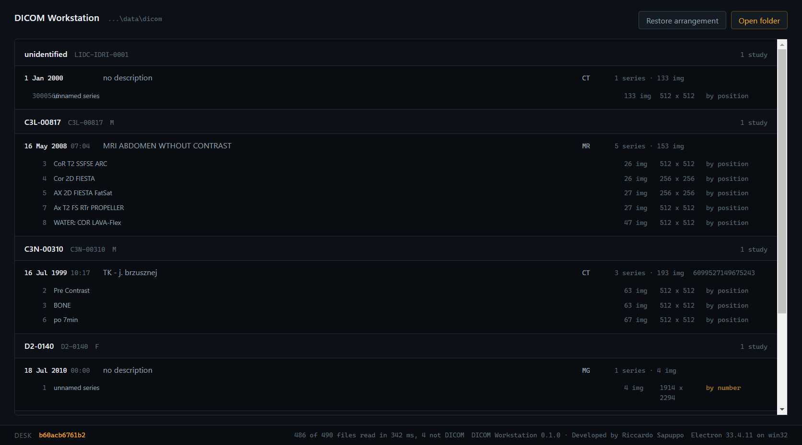
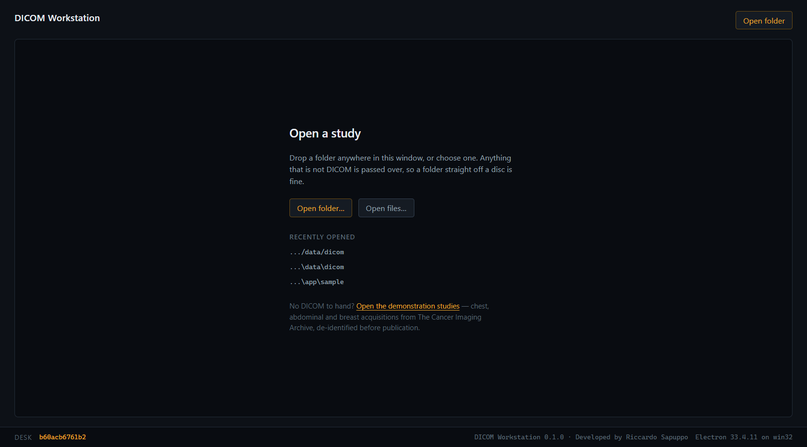

# DICOM Workstation

The desktop side of [Medical DICOM Viewer](https://github.com/riccardosapuppo/medical-dicom-viewer-web):
the same viewer, reading studies straight off a disc, with native windows placed
on the panes of glass they belong to and arrangements that come back the next
morning.

It is not a second viewer. That was the first attempt and it was the wrong one —
a renderer written from scratch, which meant two different products under one
name and a desktop version that could not open half of what the web one could.
What is here now is the web viewer, fetched from its own repository at a fixed
commit and used unchanged. What this repository adds is everything a desktop
needs and a browser cannot have: a folder read off a disc, several monitors, and
an application that works with nothing installed and no network at all.

The original was built for a client and lives in a private repository. This is an
independent reimplementation, written from scratch against public data.

## Where it is

```
npm install
npm run viewer             # fetches and builds the viewer (slow, needs a connection)
npm run demo-data          # downloads five studies from The Cancer Imaging Archive
npm start                  # builds and opens the window
npm start -- --open ./demo-data
npm run index -- ./demo-data   # the same reading, in the terminal, no window
npm run displays           # what screens are attached, and this desk's fingerprint
npm test
npm run check:viewer       # drives the application until the viewer has drawn a study
npm run mutations          # breaks the code on purpose, checks the tests notice
npm run package            # an installer for the system you are on
npm run check:packaged     # the same check, against the packaged build
```

`npm run viewer` is the one that takes a while: it fetches the viewer's
repository at the commit named in `viewer.json`, installs it, and builds it. Ten
to twenty minutes the first time, several gigabytes while it happens, and about
38 MB left behind in `viewer-dist/`. None of it is committed here — a vendored
monorepo is one that never gets updated again, and the two projects would drift
into being two products with one name.



## How a folder becomes an archive

The viewer reads from a DICOMweb archive. So this side does not reimplement a
viewer: it becomes one.

```
a folder on a disc
        |
   indexer (a process of its own)
        |
   patients, studies, series, images
        |
   QIDO-RS and WADO-RS, on 127.0.0.1
        |
   the viewer, unchanged
```

There is nothing to install and nothing to configure. The archive starts with
the application, bound to loopback on a port the system picks, and it answers
for exactly the folder that is open — a study elsewhere on the disc is a 404,
because the window cannot name a path and so cannot ask for one.

Every address sits under a secret generated at startup. Loopback is not a
boundary on a shared machine: any other process can walk the ports. The secret
means guessing the port is not enough, and it never leaves the application.

The archive is read-only. There is no STOW-RS; nothing here writes to a
patient's files.

**Metadata is converted by the same library the viewer reads it with**, so both
ends agree about names, sequences and which values are numbers by construction
rather than by luck. Three things that conversion gets wrong on its own, all
found by tests rather than by reading:

- told to stop before the pixels, the parser leaves a plain number behind where
  the image would be. It is a byte offset. Read as a list it throws, inside a
  request handler, which then never answers at all — the viewer waits forever on
  a socket with nothing on it.
- a run of bytes is, to a naive walk, an object with numbered keys. Walking into
  one turns a lookup table into a hundred thousand objects. Bytes are carried as
  base64, which is how the standard carries them.
- a person's name is an object with named fields, not a nested dataset. Cleaned
  as though it were one it comes back empty, and every study then shows a blank
  where the patient belongs.

A fault in a handler is now a refusal with a reason, never a silent socket.

## Nothing leaves this machine

Requests off the machine are refused outright rather than trusted not to happen.
What is left is the viewer's own scheme and the archive on loopback; everything
else is cancelled before it is made.

This is not decoration. A reading station holds a person's studies, often on a
machine that has never been connected to anything, and the promise it makes is
that opening one does not tell anybody. A promise kept by nobody happening to add
a request is not a promise.

It also makes the refusal visible. The viewer's page reached for one script from
a public network; under this rule that fails in a check rather than silently
working on a developer's machine and failing in a reading room. It is fetched
once, at setup, and the page is pointed at the copy.

## The studies

`npm run demo-data` downloads five studies from The Cancer Imaging Archive — the
same acquisitions the web viewer demonstrates, from the same list, because the
two are the same product:

| Collection | Study | Licence |
| --- | --- | --- |
| LIDC-IDRI | Chest CT, lung nodule screening | CC BY 3.0 |
| CPTAC-CCRCC | Abdominal CT, multiphase | CC BY 4.0 |
| CPTAC-CCRCC | Renal MR, five series | CC BY 4.0 |
| CMMD | Screening mammogram, four views | CC BY 4.0 |
| CMB-BRCA | Bilateral mammogram, three named series | CC BY 4.0 |

They are real clinical acquisitions, de-identified by the archive before
publication. The full citations and DOIs are in `data/studies.json`, and each
download carries its collection's licence, which is kept next to the images it
applies to. None of it is committed here: 486 images land in a folder that is
ignored, so a clone stays small and the licence terms stay simple.

`npm run demo-data:drawn` writes synthetic studies instead — drawn from a
formula, no connection needed. That is what the tests use, because they need
something fast, offline and identical every time. It is not what a person is
shown: a viewer whose only example is a drawn ellipse says nothing about whether
it reads a study.

## Screens, and a desk that remembers

Hovering a series in the worklist shows one small button per screen. Pressing one
opens that series in a window of its own on that pane of glass: no worklist, no
folder, nothing but the viewer on that study, because that is what a reporting
monitor is for.



Where each series was put is written down against the desk fingerprint, and
**Restore arrangement** brings the windows back. Keyed on the fingerprint rather
than on screen ids for the reason the fingerprint exists: a radiologist who docks
their laptop in the morning gets the arrangement they left, and the same person
working from the laptop alone gets a different desk and a different arrangement —
which is correct, not a failure to remember.

A placement on a screen that is no longer attached is never used. The arrangement
was made on a bigger desk, and a window opened at coordinates nobody can see is
worse than a window that did not open.

Windows are placed inside a pane's work area rather than over the whole of it,
and one pixel in on each side. A window covering the taskbar is one somebody
cannot get out from behind, and a window exactly the size of the work area is
treated by Windows as maximised and loses its border, which makes two adjacent
reading windows impossible to tell apart.

None of this has met real hardware. This machine has one screen, so the checks
exercise the whole path and not the placement, and the placement itself — a
monitor left of the primary and therefore at negative coordinates, a portrait
pair, a taskbar down one side — is covered by tests against invented desks.
Inventing one is the only way to test a desk nobody owns, and it is not the same
as owning it.

## Why the worklist is still here

The viewer has a study list of its own, and this application does not use it as
the way in. The worklist here does three things that are about the machine rather
than about reading a study: it reads a folder and reports what was in it, it
names the files that claimed to be DICOM and would not parse, and it sends a
series to another screen. Opening a series hands the window to the viewer at that
study, so there is one list and not two in a row.

## Where the reading happens

Not in the window, and not in the page.

A thousand headers is a thousand file opens and a thousand parses. In the main
process that blocks the event loop and the window stops repainting — the
application looks hung at exactly the moment it is working hardest. In the
renderer it would mean handing a page the file system, which is the one thing a
viewer that renders whatever a study contains should not have.

So it happens in a utility process: Node, with the disc, and no window. It
reports progress once per percent rather than once per file, because on a fast
disc the messages cost more than the reading. Picking a second folder while the
first is still going aborts it — finishing would send back a list for a folder
nobody is looking at any more. If the process dies mid-folder the window is told
which folder was lost, instead of watching a progress bar that will never move
again.



With no folder open the window shows the desk it is standing on, drawn to scale.
That is not a placeholder: everything this application does is place windows on
those panes and put them back where they were, and being able to see the
arrangement it believes in is what makes that debuggable rather than magic. It
redraws when a monitor is plugged, unplugged or rescaled — and only when the
fingerprint actually moves, since the same event also fires for a colour profile
change, which moves no window. The picture above is from a machine with one
screen, which is why there is no desk drawn in it.

The pictures in this file are taken by `node scripts/screenshots.mjs`, driving
the real application. A README whose pictures are of a version that no longer
exists is worse than one with no pictures at all.

## Reading a folder

`npm run index -- ./demo-data` walks a folder, reads every DICOM header it finds,
and prints the reading list. Three decisions in it are worth stating.

**The pixels are never read.** A chest CT is a few hundred files of half a
megabyte each, and indexing them means opening every one. The reader takes a
chunk off the front and parses until the pixel data element, so a study of any
size costs a few hundred bytes per image instead of half a megabyte. The chunk
size is a guess, and a guess about DICOM headers is always wrong somewhere, so
the guess is allowed to be wrong: run off the end and it reads more.

**Slices are ordered by geometry, not by number.** InstanceNumber is a label.
Scanners number series backwards relative to the direction of travel, some do not
number them at all, and a series merged from two acquisitions can repeat numbers
outright. What is reliable is that each slice carries its own corner in patient
coordinates and the series carries the plane it was cut on: project one onto the
normal of the other and you have a real distance along the stack. The listing
says which key each series was sorted by, because a stack ordered by number is a
stack that might be upside down.

**A folder from a CD is a mess, and that is not an error.** Autorun files,
readmes, thumbnails and the viewer that came on the disc are counted and passed
over. A file that claims to be DICOM and will not parse is a different thing
entirely — that is a missing slice — so it is reported by name.

## Why a fingerprint, and not the screen id

The operating system hands out an id for every display, and it is the obvious key
for remembering where a radiologist put their windows. It is also the wrong one:
those ids do not survive a reboot, a cable moved to another port, or a monitor
waking in a different order. A layout saved against them comes back attached to
the wrong glass, or to none.

What does survive is the shape of the desk — how many panes, how big in real
pixels, at what scaling and rotation, and where each sits relative to the
primary. The fingerprint is a digest of exactly that, with ids, labels and
enumeration order deliberately thrown away first.

## Checking that it works

`npm test` runs 135 tests. `npm run mutations` breaks the code on purpose in 44
places and checks the tests notice; none of them survive. The harness refuses to
start against a suite that is already failing, and a mutation that will not
compile is reported as broken rather than counted as caught — a check that cannot
fail is worse than no check, and that was learned here rather than known.

The five aimed at the archive are the ones that matter most: a search in the
study list that matches everybody, a study that reports its images as though they
were series, a patient's name cleaned away, every study served shifted by one
slice, and an archive that any secret opens.

`npm run check:viewer` is the one that could not be written any other way. It
opens the application on a folder, waits for the worklist, clicks a series, and
then confirms the viewer drew it — from the archive, having asked nobody outside
for anything, with nothing reported broken by the page. Every piece of that can
be right on its own and still not meet in the middle: a scheme registered without
the privileges the viewer needs, a configuration pointed at the wrong address, a
frame served in a shape the decoder does not accept. None of it shows up in a
unit test, and all of it shows up as a black rectangle.

## What an adversarial reading found

Twelve readers were set on this code with instructions to break it, each one
given a different thing to look for, and every claim they made was handed to a
second reader whose job was to refute it. Fifty-four claims: thirty-two were
wrong, twenty-two survived. Every one of the twenty-two is fixed, and each has a
test and an entry in the mutation harness.

The two worth naming, because both were silent:

**A header could be read short without anything raising.** The parser walks
elements until the buffer runs out. When it runs out in the middle of one it
raises, and the reader reads more — which is what the growth loop was written for
and what the tests covered. When it runs out exactly *between* two elements it
stops cleanly and hands back what it has, and what is missing is the tags at the
end, which is where the pixel data is. The image listed correctly and could never
be opened. It now reads more until it has actually reached the pixel data,
because arriving there is the only proof there was nothing after it.

**Images with no identifier were counted as copies of each other.** A missing SOP
Instance UID reads as an empty string, and deduplication keyed on it: five
anonymised slices became one, and the other four were reported as duplicates — a
false statement about four images that had simply gone. Anonymisers blank that
tag rather than removing it, so this is not a corner case.

The rest were of the same family: progress from a folder the user had already
left driving the new folder's bar, a lowercase `dicomdir` indexed as a phantom
study, an index that came out differently on two runs over one unchanged folder
because eight readers finished in whatever order the disc answered in, and four
tests that could not fail.

## Installing it

```
npm run package        # an installer for the system you are on
npm run package:dir    # the same application, unpacked, without an installer
npm run check:packaged # the check above, driven against the packaged build
```

On Windows that installs per user and needs no administrator: a reading room
installs software on machines it does not administer, and an installer that
demands elevation is one that does not get run. macOS gets a disk image and Linux
an AppImage, from the same configuration.

`check:packaged` matters because packaging mistakes live there and nowhere else —
the viewer left out of the archive, a path that worked relative to the project
and does not relative to an installed application, a file the build configuration
quietly excluded. Every one of them looks perfect in development and gives a
blank window to whoever installs it.

The icon is drawn by `npm run icon`, in about fifty lines and with nothing but
zlib. The alternative was a binary in the repository that nobody can see the
provenance of, or an image library in a project that has no other use for one.

### Signing and updates, honestly

Neither is done, and the configuration says where they would go.

Code signing needs a certificate that belongs to a person or a company, is bought
rather than configured, and cannot be checked into a repository. The build is
complete up to that point and produces an unsigned application, which Windows
will warn about on first run and macOS will refuse to open without being told to.

The update feed is configured — provider, owner, repository — and nothing is
published to it. An installed copy would look for a newer one at that address and
find nothing there. The address is written down because it is part of the design,
not because a release exists.

## No patient data

There is none in this repository and there never will be. What `npm run
demo-data` fetches is published under Creative Commons Attribution by the archive
that de-identified it, and it lands in a folder that is not committed.

## Limits, honestly

- The viewer is fetched and built, not shipped. A clone without a connection
  cannot build one, and the application says so on its opening screen rather than
  going blank.
- The viewer at `viewer.json`'s commit is what this was checked against. A newer
  one may well work; nothing here pins its behaviour beyond that commit.
- The archive answers the queries the viewer makes. It is not a general DICOMweb
  server: no STOW-RS, no bulk data endpoint beyond frames, and one frame per
  request rather than the ranges the standard allows.
- A series sent to a screen opens where the desk remembers it; the main window
  itself is not placed or remembered, and always opens on the primary.
- Windows already open are not re-placed when a monitor is unplugged mid-session.
  The system moves them somewhere visible and the new desk gets its own
  arrangement from then on.
- Verified on Windows 11 against a single built-in screen. Every multi-monitor
  case here is covered by tests against invented desks, because inventing one is
  the only way to test it without owning it. None of it has met real hardware.
- Explicit and implicit VR little endian are read by the index, and both are
  covered by tests. Big endian is not handled.
- Files without the 128-byte preamble and `DICM` marker are treated as not DICOM.
  Raw datasets written without a Part 10 wrapper are skipped.
- `physical` is `bounds x scaleFactor` — the panel's real pixel count as the
  system reports it, which is not the same as its advertised specification.
- If `ELECTRON_RUN_AS_NODE` is set in your shell, Electron starts as plain Node
  and no Electron API exists. `npm run displays` says so and stops.

---

Developed by Riccardo Sapuppo.
